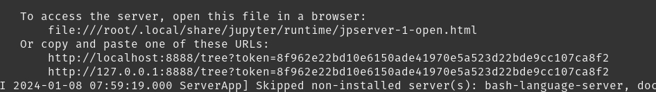
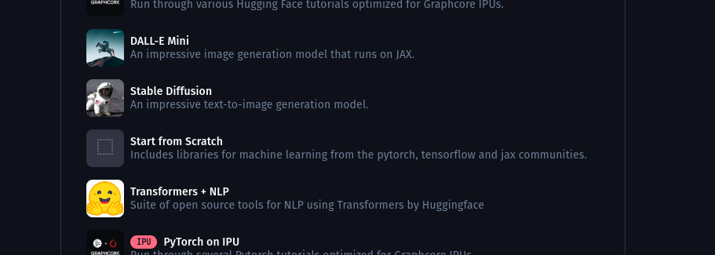
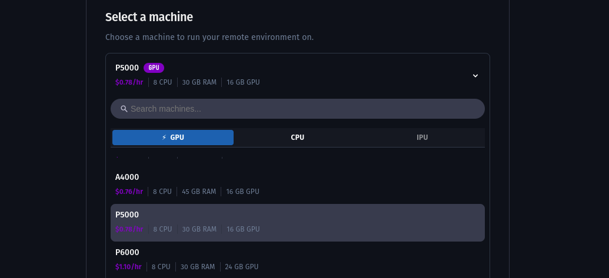
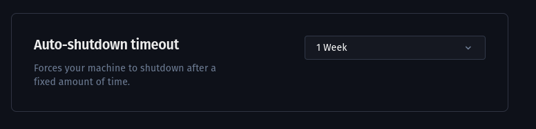
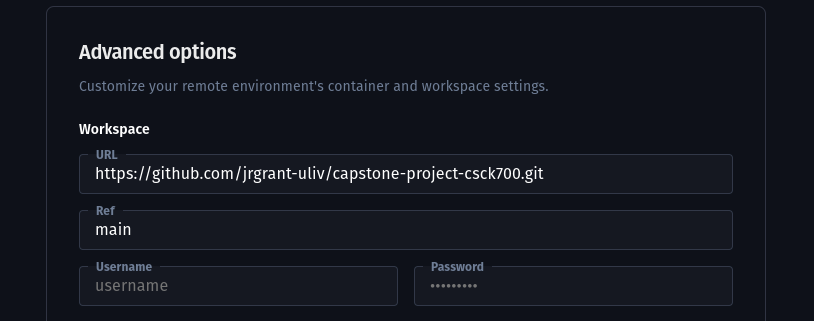
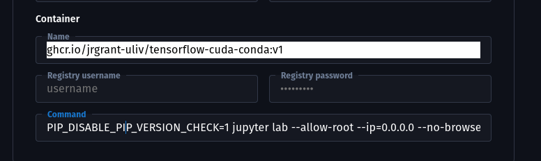

# IT Artefact for CSCK700 - James Grant

This project is structured to run in a Docker container (ghcr.io/jrgrant-uliv/tensorflow-cuda-conda) for maximum portability. This container is pre-configured with Tensorflow, NVidia Cuda, and Miniconda and can be used on local cuda-capable hardware or cloud-based services like [Paperspace Gradient](https://www.paperspace.com/). If [Google Colab](https://colab.research.google.com/) is preferred, some Colab-specific code has been included to make it a seamless experience. 

## Setup

### 1. Local Container

Instructions running the experiment locally in a Docker container.

#### Cloning the Repository

To clone this repository locally, follow these steps:

1. Open a terminal or command prompt.
2. Navigate to the directory where you want to clone the repository.
3. Run the following command:

   ```bash
   git clone https://github.com/jrgrant-uliv/capstone-project-csck700.git
   cd capstone-project-csck700.git
   ```

#### Pull the container image

To pull a public container image from ghcr.io, follow these steps:

1. Open a terminal or command prompt.
2. Run the following command:

   ```bash
   docker pull ghcr.io/jrgrant-uliv/tensorflow-cuda-conda
   ```

3. Wait for the container image to be downloaded.

#### Run the project in the docker container

To start the docker container with the working directory mounted, use the following command:

    ```bash
     docker run --rm --runtime=nvidia --gpus all -p 8888:8888 -v $(pwd):/ ghcr.io/jrgrant-uliv/tensorflow-cuda-conda
    ```

Ctrl+Click on the notebook link in your terminal:



### 2. Paperspace Gradient

Instructions for running the experiment in Paperspace Gradient

These instructions assume you have a Paperspace Gradient account, to register one go here: https://console.paperspace.com/login

Create a Paperspace Gradient project:

1. Once you have signed into your account on the Paperspace website:
2. Click on "Projects" in the sidebar menu.
3. Click on the "New Project" button.
4. Enter a name for your project and select the desired options.
5. Click on the "Create Project" button.
6. Once the project is created, you can access it from the Projects page.

Create a Notebook:

1. Select the project where you want to create the notebook.
2. Click on the "Notebooks" tab.
3. Click on the "New Notebook" button.
4. On the "Launch a notebook" step, select "Start from Scratch" as your notebook type.



5. Select a machine, the P5000 image is recommended



6. If you plan on running the whole experiment or the Transformer portion, the project will run for longer than 24 hours, set the timeout to 1 Week, alternatively 1 day would be sufficient.



7. Click on the "View advanced options" button.
8. Set the Workspace settings:
   - Wporkspace: https://github.com/jrgrant-uliv/capstone-project-csck700.git
   - Ref: main
   - Username: blank
   - Password: blank



9. Set the Container settings:
   - Name: ghcr.io/jrgrant-uliv/tensorflow-cuda-conda:v1
   - Registry Username: blank
   - Registry Password: blank



10. Click on the "Start Notebook" button.

### 3. Google Colab

Instructions to run experiment on Google Colab

#### Clone the Github Repository

To clone this repository locally, follow these steps:

1. Open a terminal or command prompt.
2. Navigate to the directory where you want to clone the repository.
3. Run the following command:

   ```bash
   git clone https://github.com/jrgrant-uliv/capstone-project-csck700.git
   cd capstone-project-csck700.git
   ```

#### Open the notebook on Colab

To open the notebook on Google Colab, follow these steps:

1. Go to the [Google Colab website](https://colab.research.google.com/).
2. Click on "File" in the menu bar.
3. Select "Upload notebook" from the dropdown menu.
4. Click on the "Browse" button
5. Navigate to the source code directory
6. Select the "csck_700_experiment.ipynb" file

#### Run the "Colab Setup" cell in the notebook

To run the "Colab Setup" cell in the notebook, follow these steps:

1. Open the notebook in Google Colab.
2. Select a GPU-equipped runtime (T4 GPU is sufficient)
3. Scroll to the "Colab Setup" cell.
4. Click on the play button next to the cell.
5. The cell will run and set up the necessary dependencies and configurations for the notebook.
